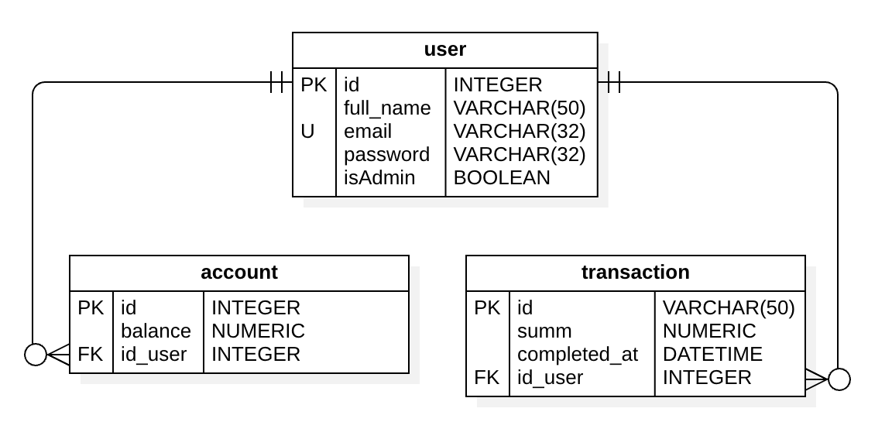
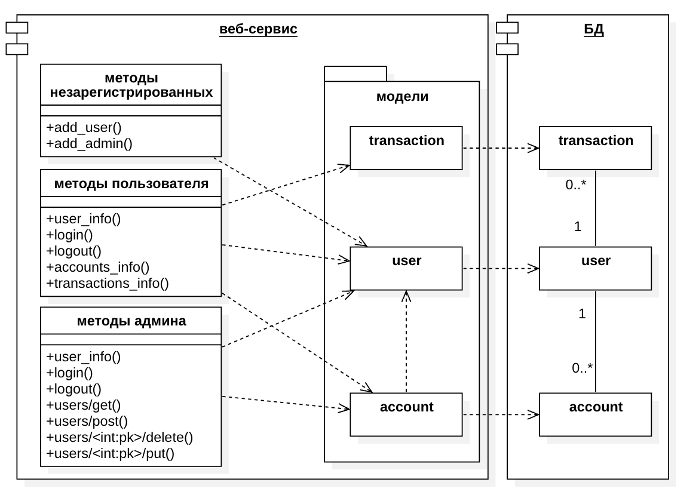

# Асинхронное веб-приложение с REST API
## Обзор
Проект - асинхронное веб-приложение, созданное на Python, с использованием Sanic в качестве веб-фреймворка, SQLAlchemy для работы с базой данных и PostgreSQL в качестве системы управления базами данных. Реализовано RESTful API для управления пользователями, администраторами, счетами и транзакциями. Приложение поддерживает аутентификацию пользователей, отслеживание балансов счетов и обработку транзакций через эмуляцию вебхука.

## Структура проекта

ERD-диаграмма:


Диаграмма классов:


## Авторизация и Аутентификация

Проект использует JWT (JSON Web Tokens) для авторизации и аутентификации пользователей. После успешной регистрации или входа в систему сервер генерирует JWT, который отправляется клиенту. Этот токен затем используется для подтверждения подлинности и проверки прав пользователя при последующих запросах к защищенным ресурсам.

## Хеширование Паролей

В проекте используется метод хеширования паролей с использованием алгоритма MD5. Для каждого пользователя при регистрации его пароль объединяется с солью. Затем результат этого объединения хешируется с помощью MD5, что обеспечивает безопасное хранение паролей даже в случае компрометации базы данных.

## Руководство по запуску
### С использованием Docker Compose

- Убедитесь, что у вас установлены Docker и Docker Compose на вашей машине.
- Склонируйте данный репозиторий на вашу локальную машину.
- Перейдите в директорию проекта.
- Соберите и запустите приложение с использованием Docker Compose:

```
docker-compose up --build
```

Ваше приложение будет доступно по адресу http://localhost:8000.
### Без использования Docker Compose

- Убедитесь, что у вас установлен Python 3.9+.
- Клонируйте репозиторий на свою локальную машину.
- Установите зависимости:

```
pip install -r requirements.txt
```

- Создайте файл .env в корне проекта со следующим содержимым:

```
DB_HOST=db
DB_PORT=5432
DB_NAME=accounts_transactions
DB_USER=postgres
DB_PASS=1234
```

- Запустите миграции Alembic:

```
alembic upgrade head
```

- Запустите приложение:

```
python src/server.py
```

Ваше приложение будет доступно по адресу http://localhost:8000.
## Пользовательские учетные данные
По умолчанию создаются два пользователя:
| Email          | Password |
|----------------|----------|
| user@ex.com    | 1234     |
| admin@ex.com   | 4321     |
